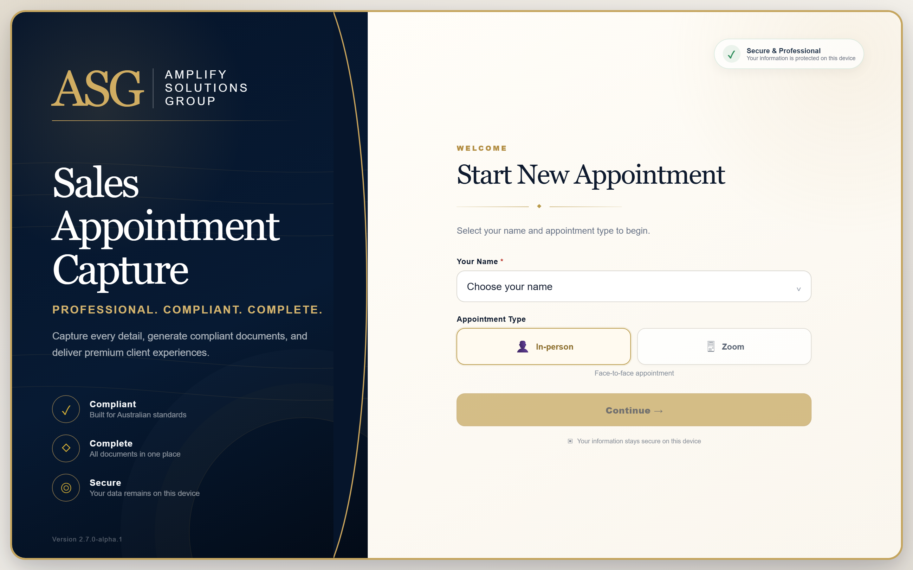
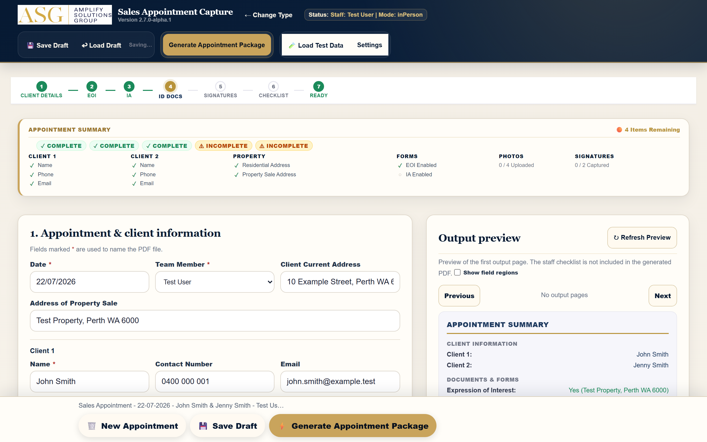
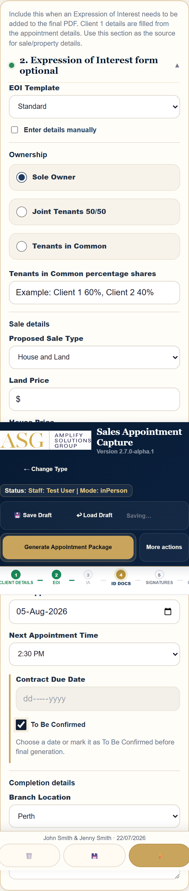
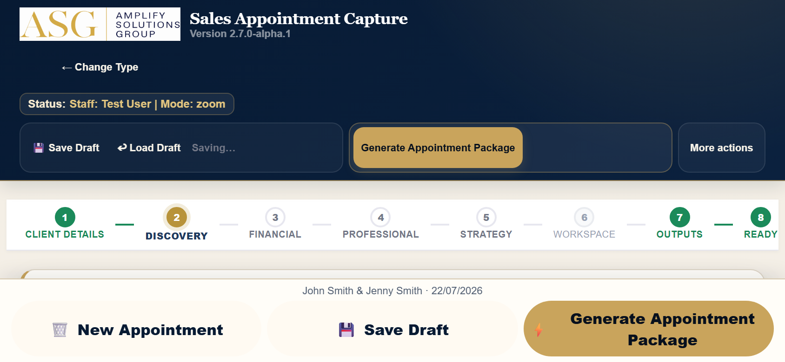
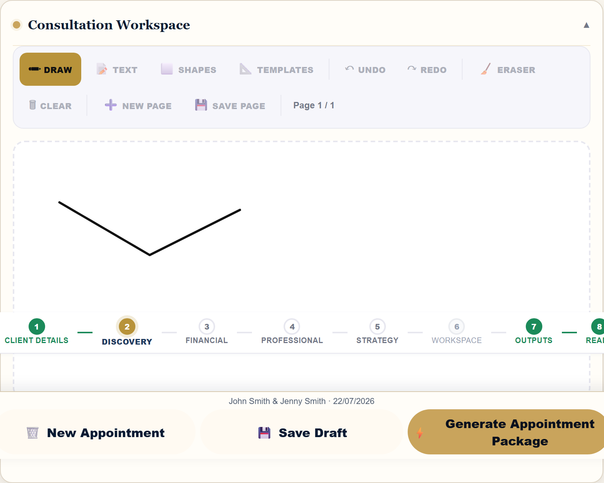
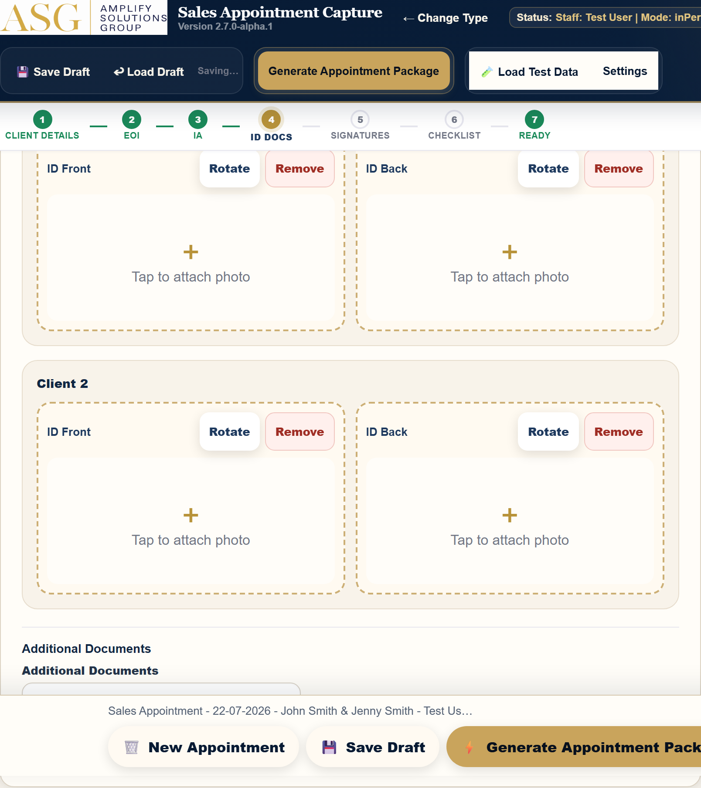
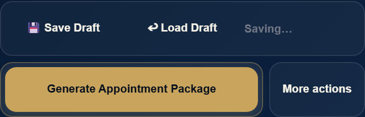
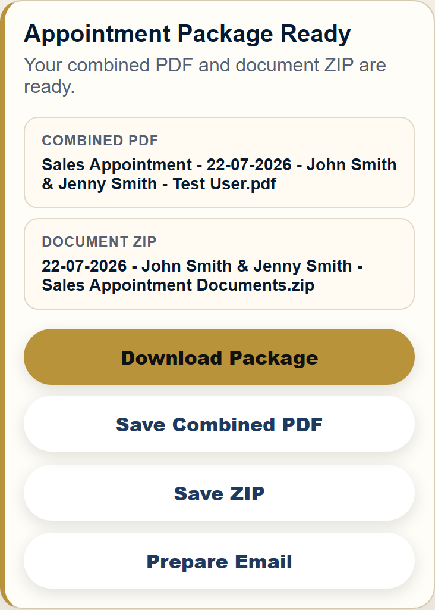
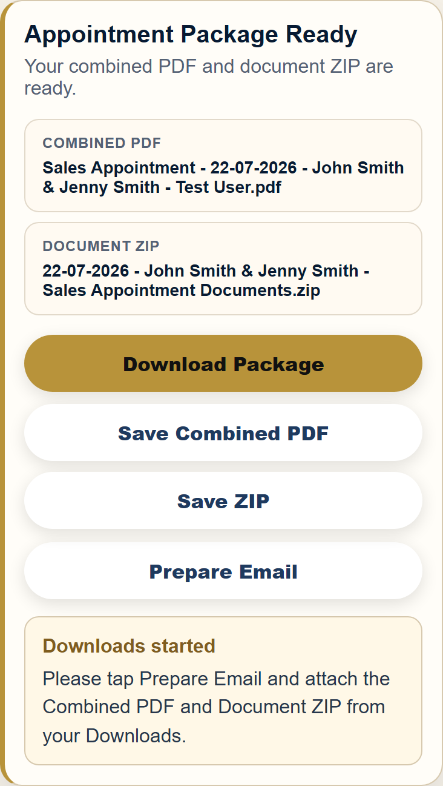

# Sales Appointment Capture

<!-- docs-automation:metadata:start -->
**Application version:** 2.7.0-alpha.1 
**Guide version:** 1.0.0 
**Generated:** 22 July 2026 
**Git branch:** fix/staff-dropdown-seeding-v2 
**Source commit:** 9db1800ce947f634520bb391826ad44ded8a6b82
<!-- docs-automation:metadata:end -->

## Staff User Guide

**ASG internal staff resource**  

This guide explains the complete staff workflow for in-person and Zoom sales appointments. Examples use fictional test information only.

---

## 1. Overview

Sales Appointment Capture guides staff through appointment details, required forms, supporting evidence, signatures and final handover documents. The application is designed for desktop, tablet and mobile use.

### What the application produces

- A **Combined PDF** containing the selected client forms and attached ID/photo pages.
- A **Document ZIP** containing the individual generated form PDFs and supporting uploaded documents.
- A prepared email addressed to the configured recipient, ready for the generated files to be attached.

> **Important:** The on-screen staff checklist is not included in the client PDF. It supports the appointment process only.

### Core status cues

| Status | Meaning |
|---|---|
| Unsaved changes | Information has changed since the last draft save. |
| Draft saved | The current draft was saved on this device. |
| PDF ready | The latest appointment output was generated. |
| Output invalidated | A field changed after generation; regenerate before handover. |

---

## 2. Quick Start

1. Open **Sales Appointment Capture**.
2. Select your name.
3. Choose **In-person** or **Zoom**.
4. Select **Continue**.
5. Complete each relevant stage from left to right.
6. Save a draft during the appointment.
7. Resolve every item shown in **Appointment Summary**.
8. Select either a Contract Due Date or **To Be Confirmed**.
9. Choose **Generate Appointment Package**.
10. Download the Combined PDF and Document ZIP, then prepare the email.

> **Before you begin:** Confirm the correct staff member and appointment type. These choices control the visible workflow and generated filenames.

---

## 3. Choosing the Appointment Type

### In-person

Use for face-to-face appointments that may require an Expression of Interest (EOI), Irrevocable Authority (IA), ID photographs and client signatures.

The in-person timeline contains seven stages:

1. Client Details
2. EOI
3. IA
4. ID Docs
5. Signatures
6. Checklist
7. Ready

### Zoom

Use for online consultations. The Zoom timeline contains eight stages:

1. Client Details
2. Discovery
3. Financial
4. Professional
5. Strategy
6. Workspace
7. Outputs
8. Ready

> **Tip:** Use **Change Type** only when the appointment mode was selected incorrectly. Confirm the current information has been saved first.

---

## 4. Staff Login and Appointment Setup

Select your own staff record on the landing page. This selection is used in the appointment workspace, generated filenames and prepared-email sign-off.

### Initial appointment details

| Field | What to enter |
|---|---|
| Date | Appointment date in Australian format. |
| Team Member | Confirm the selected staff member. |
| Client Current Address | Client's present residential address. |
| Address of Property Sale | Property connected with the appointment. |
| Client 1 | Name, contact number and email. |
| Client 2 | Complete only when a second client participates. |

Use **Client 2 added** or **Not required** as the visible participation cue. Client 2 remains optional unless the appointment genuinely includes a second client.

> **Privacy:** Use the application only for the active appointment. Do not use real client information in demonstrations or training captures.

---

## 5. In-Person Workflow

Move through the seven-stage timeline from left to right. A green stage indicates complete, gold indicates the current stage, and an outlined stage still needs attention.

### Recommended order

1. Confirm client and property details.
2. Enable and complete EOI when required.
3. Enable and complete IA when required.
4. Attach clear ID images for participating clients.
5. Capture signatures in the correct signature fields.
6. Review the staff checklist and Appointment Summary.
7. Generate the final package only when the Ready stage is satisfied.

> **Important:** Enabling EOI or IA adds the corresponding form to the generated output. Leave a form disabled when it is not part of the appointment.

---

## 6. Sale Details

Complete Sale Details when EOI is enabled. Fields adapt to the selected sale type and Client 2 participation.

| Area | Guidance |
|---|---|
| EOI Template | Use the configured template unless instructed otherwise. |
| Ownership | Choose Sole Owner, Joint Tenants 50/50 or Tenants in Common. |
| Percentage shares | Enter shares when Tenants in Common applies. |
| Proposed Sale Type | Select the sale structure discussed with the client. |
| Prices | Enter the applicable land, house and total amounts. |
| Finance | Record each participating client's finance percentage. |
| Next Appointment | Enter the EOI follow-up date and time. |
| Contract Due Date | Choose a date or select **To Be Confirmed**. |
| Branch Location | Select the physical appointment branch. |

The Contract Due Date may be blank while editing or saving a draft, but final generation requires exactly one date or **To Be Confirmed**.

---

## 7. Zoom Workflow

The Zoom workspace preserves the online consultation structure and keeps the eight stages visible horizontally.

### Complete the consultation

- **Discovery:** capture the client's objectives and current position.
- **Financial:** record the relevant financial discussion.
- **Professional:** capture professional contacts and referrals.
- **Strategy:** document the strategy discussion and recommendations.
- **Workspace:** use the whiteboard when a visual explanation helps.
- **Outputs:** select the forms and documents required for handover.

The Zoom Client Review date is the next-appointment source for the prepared email. A time is included only if the workflow already stores one.

> **Tip:** Save the draft before changing appointment type or leaving the browser.

---

## 8. Zoom Whiteboard

Use the Consultation Workspace to sketch explanations during a Zoom appointment.

### Whiteboard controls

| Control | Purpose |
|---|---|
| Draw | Freehand drawing with pointer or touch input. |
| Text | Add a text annotation. |
| Shapes | Add supported diagram shapes. |
| Templates | Start from an available workspace template. |
| Undo / Redo | Move backward or forward through recent changes. |
| Eraser | Remove selected strokes. |
| Clear | Clear the current page after confirmation. |
| New Page | Add another workspace page. |
| Save Page | Save the current whiteboard page. |

Rotate the device if more drawing space is needed. Confirm the canvas remains visible after rotation before continuing.

---

## 9. ID Documents and Signatures

Attach legible ID images and capture signatures only with the client's knowledge and consent.

### ID photographs

1. Tap the correct **ID Front** or **ID Back** area.
2. Take a new photo or choose the correct existing image.
3. Confirm the image is upright and readable.
4. Use **Rotate** if required.
5. Use **Remove** and retake if the image is blurred, cropped or incorrect.

### Signatures

- Confirm the correct client name above each signature area.
- Ask the client to sign within the boundary.
- Clear and repeat any incomplete signature.
- Review signatures before package generation.

> **Important:** Uploaded ID, photos and supporting PDFs may be included in the Document ZIP. Check every file before handover.

---

## 10. Saving and Loading Drafts

Drafts are stored on the current device. Save regularly during an appointment.

### Save a draft

1. Select **Save Draft**.
2. Wait for the saved status confirmation.
3. Continue editing. The status changes to **Unsaved changes** after the next modification.

### Load a draft

1. Select **Load Draft** or resume the recent draft from the landing page.
2. Confirm the appointment details, mode and staff member.
3. Review uploaded evidence and signatures.
4. Continue from the first incomplete stage.

> **Warning:** A draft is device-local. Clearing browser data, removing the PWA or using another device may make that draft unavailable. Download final files before closing a completed appointment.

---

## 11. Generating the Appointment Package

Select **Generate Appointment Package** only after the Appointment Summary is complete.

### Final-generation checks

- Required client and property details are present.
- Selected EOI and IA fields are complete.
- Contract Due Date has a valid date or **To Be Confirmed**.
- Required ID images, supporting documents and signatures are present.
- The selected staff member and appointment date are correct.

Generation stops and shows an inline message when required information is missing. Correct the highlighted field, then generate again.

After successful generation, the package-ready panel displays the exact Combined PDF and Document ZIP filenames.

---

## 12. Downloading and Emailing

The package-ready panel provides four actions:

| Action | Result |
|---|---|
| Download Package | Starts both the Combined PDF and Document ZIP downloads. |
| Save Combined PDF | Downloads the single client-ready PDF. |
| Save ZIP | Downloads individual form PDFs and supporting documents. |
| Prepare Email | Opens a prepared message with appointment handover details. |

After **Download Package**, confirm this message:

> **Downloads started**  
> Please tap Prepare Email and attach the Combined PDF and Document ZIP from your Downloads.

The prepared email does not attach files automatically. Add both downloaded files before sending. If the native mail action does not open, use the displayed fallback details to create the message manually.

---

## 13. Reviewing Generated Documents

Review both deliverables before handover.

### Combined PDF

- Open the PDF and move through every page.
- Confirm client names, property, appointment date and staff name.
- Confirm selected EOI and IA forms are present.
- Check conveyancer details and signatures.
- Confirm attached ID/photo pages are readable and correctly oriented.

### Document ZIP

The ZIP contains the individual generated document PDFs plus supporting uploaded ID/photo/additional-document PDFs. It does **not** contain a second copy of the Combined PDF.

Filenames use the appointment date and actual client names where available. If the application reports that the output was invalidated after an edit, regenerate before downloading or emailing.

> **Handover rule:** Use only the latest generated package. Delete superseded test or duplicate downloads from the device.

---

## 14. Troubleshooting

| Issue | Action |
|---|---|
| Continue is disabled | Select both your name and an appointment type. |
| Items remain incomplete | Expand Appointment Summary and follow the incomplete markers. |
| Contract Due Date error | Select a date or **To Be Confirmed**. Do not leave both blank. |
| Generated output became invalid | A relevant field changed. Select **Generate Appointment Package** again. |
| Draft cannot be found | Confirm you are using the same browser and device. |
| Download is not visible | Check the browser's Downloads list and device Files app. |
| Email does not open | Use the on-screen fallback recipient, subject and body. |
| Whiteboard does not respond | Ensure Draw is selected, then rotate back or refresh only after saving the draft. |
| PDF preview looks stale | Select **Refresh Preview**. |

If an issue persists, record the device, operating system, browser, appointment mode and exact steps. Do not include real client data in support screenshots.

---

## 15. Best Practices and Physical-Device Tips

### During every appointment

- Use one browser tab for the active appointment.
- Save after each major section.
- Check the Appointment Summary before moving to Ready.
- Keep the screen awake during uploads and package generation.
- Verify filenames before sharing.

### On iPhone or iPad

- Use portrait for form entry and landscape when the whiteboard or preview needs more width.
- After the software keyboard opens, confirm the focused field remains visible.
- Allow the browser's download prompt and locate files in Downloads.
- Check bottom actions remain clear of the home indicator.
- When using the installed PWA, allow an update to finish before starting an appointment.

### Accessibility

All actions can be reached by keyboard. Focus indicators show the active control. The compact **More actions** menu supports Enter, Space, Escape, Tab and Shift+Tab. Use VoiceOver or the device screen reader when required.

---

## 16. Final Checklist

Before ending the appointment, confirm:

- [ ] Correct staff member and appointment type selected.
- [ ] Client names, contacts and property address checked.
- [ ] Client 2 correctly marked present or not required.
- [ ] Required EOI and IA options selected and completed.
- [ ] Next appointment recorded when applicable.
- [ ] Contract Due Date selected, or **To Be Confirmed** chosen.
- [ ] ID images are clear, complete and correctly oriented.
- [ ] Signatures are present in the correct fields.
- [ ] Appointment Summary shows no unresolved required items.
- [ ] Draft saved.
- [ ] Appointment package generated after the final edit.
- [ ] Combined PDF reviewed page by page.
- [ ] Document ZIP contents checked.
- [ ] Both files downloaded.
- [ ] Prepared email reviewed and both files attached.
- [ ] Final handover sent to the intended recipients.
- [ ] A new appointment started only after the current handover is complete.

> **Complete means checked:** Never rely on filenames or a success message alone. Open and verify the final files before sending.
